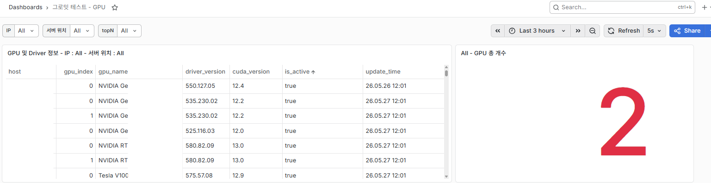
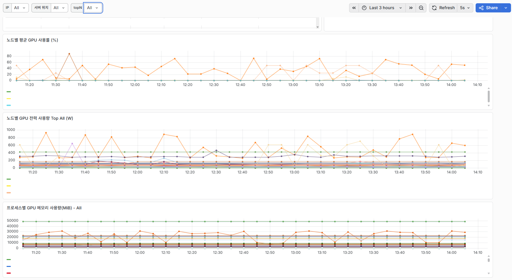
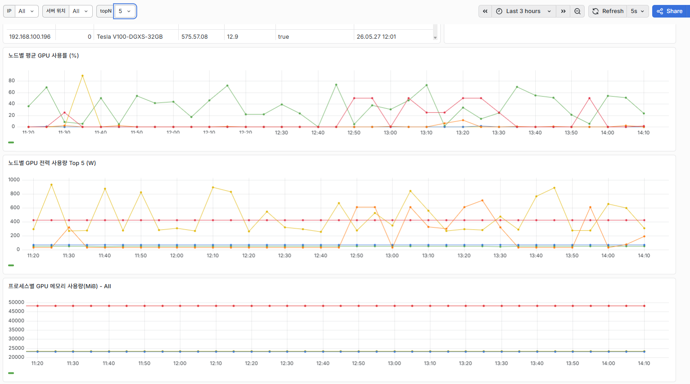
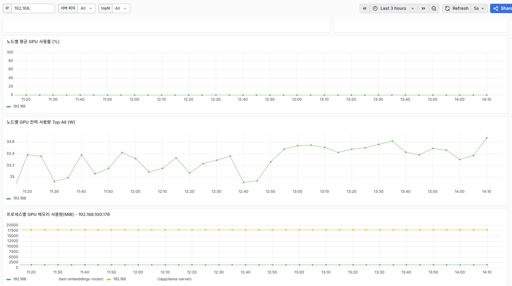
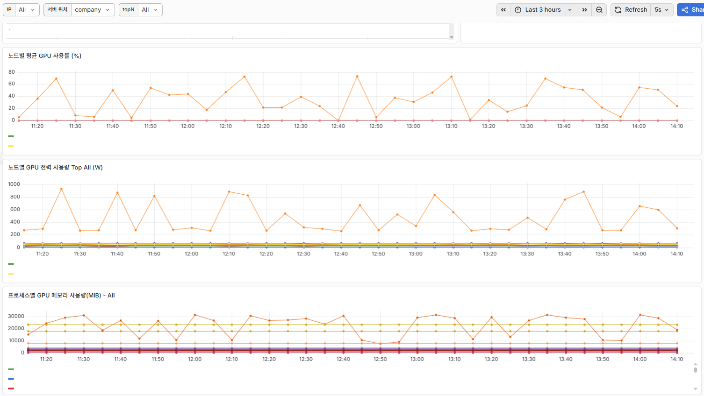

# Ansible

# 목차

- [활용 계기](#활용-계기)
- [작업내용](#작업내용)
  - [Node Exporter 설치](#node-exporter-설치)
  - [모든 서버 사양 조사](#모든-서버-사양-조사)
  - [Database로 우회하여 GPU 및 프로세스 상태 변화 수집](#database로-우회하여-gpu-및-프로세스-상태-변화-수집)
  - [Docker 설치](#docker-설치)
  - [Kubernetes 설치 (미완성)](#kubernetes-설치)
- [트러블 슈팅](#트러블-슈팅)
- [추가 작업 진행해볼 것](#추가-작업-진행해볼-것)

---

# 활용 계기

인턴 기간 동안 사내 서버와 데이터센터 서버들을 통합 모니터링할 수 있는 환경을 구축하는 업무를 맡았다.   
초기에는 각 서버에 직접 접속해 node_exporter를 설치하고 설정을 맞추는 방식으로 진행해야 했다.  

하지만 약 50개가 넘는 서버에서 이 작업을 진행해야 했기 때문에 반복성이 너무 강하다고 생각했다.    
또한 history 관리 및 작업 로그 등을 남기기가 불편하였다.  
**DevOps 엔지니어를 목표로 인턴**을 시작한 만큼, 단순 반복 작업을 그대로 수행하기보다 자동화할 수 있는 방법을 고민했다.  

또한 **인턴 기간이 끝난 뒤에도 사내에서 실제로 사용할 수 있는 결과물**을 남기고 싶었다.  
그래서 여러 서버에 비슷한 설치,설정 작업을 일관되게 적용할 수 있는 IaC 자동화 툴을 찾아보게 되었다.  

CNCF 검색, ChatGPT 검색 등 여러가지를 알아보면서 RedHat이 개발한 오픈소스 IT 자동화 도구인 Ansible을 이용해보게 되었다.  

---
# 작업내용

`추가 작업`으로 표시한 항목은 기존 요청 범위를 넘어, 모니터링 환경을 더 개선해보고자 직접 구현한 뒤 사수분께 공유드린 내용입니다.  
`추가 공부`으로 표시한 항목은 회사랑 관련 없이, 제가 편할려고 만든 작업 내용입니다.

- [Node Exporter 설치](#Node-Exporter-설치)
- [모든 서버 사양 조사 (`추가 작업`)](#모든-서버-사양-조사)
- [Database로 우회하여 GPU 및 프로세스 상태 변화 수집 (`추가 작업`)](#Database로-우회하여-GPU-및-프로세스-상태-변화-수집)
- [Docker 설치 (`추가 공부`)](#Docker-설치)  
- [Kubernetes 설치 (`추가 공부`, (미완성))](#Kubernetes-설치)  

## Node Exporter 설치

### Node Exporter란?

Node Exporter는 Prometheus 생태계의 공식 익스포터로, Linux/Unix 서버의 **하드웨어 및 OS 수준 메트릭**을 수집해 Prometheus가 스크랩할 수 있는 형태로 노출한다.

주요 수집 항목은 다음과 같다.

| 항목 | 설명 |
|---|---|
| CPU | 코어별 사용률, idle/iowait/user/system 시간 |
| Memory | 총 메모리, 사용 중, 캐시, 버퍼, 스왑 등 |
| Network | 인터페이스별 송수신 바이트, 패킷, 에러 |

기본 포트는 `9100`이지만, 이 프로젝트에서는 여러 서버에서 포트를 통일하기 위해 사용하지 않는 포트 중 하나인 **`30910`**으로 변경해 운영했다.

---

### 설계 방식

#### 전체 흐름

```
Ansible 제어 노드 (로컬)
    │
    ├─ 1. GitHub에서 node_exporter 바이너리 다운로드 (로컬 /tmp에 캐싱)
    │
    └─ 2. 각 대상 서버로 업로드 → 압축 해제 → 바이너리 배치
               │
               ├─ 3. 전용 시스템 유저(node_exporter) 생성
               ├─ 4. systemd 서비스 등록 및 활성화
               ├─ 5. 방화벽(firewalld / ufw) 중지
               └─ 6. /tmp 임시 파일 정리
```

#### 주요 설계 포인트

**1. 바이너리 로컬 캐싱 (`delegate_to: localhost`)**

50개 이상의 서버에 동일 파일을 배포할 때, 서버마다 GitHub에서 직접 다운로드하면 네트워크 부하가 심하고 속도도 느리다.
아카이브가 로컬 `/tmp`에 없을 때만 한 번 다운로드하고, 이후 서버들에는 `copy` 모듈로 업로드하는 방식을 사용했다.

```yaml
- name: Check node_exporter archive exists
  stat:
    path: "/tmp/node_exporter-{{ node_exporter_version }}.linux-{{ arch }}.tar.gz"
  register: node_exporter_archive
  delegate_to: localhost

- name: Download node_exporter
  get_url:
    url: "https://github.com/prometheus/node_exporter/releases/download/..."
    dest: "/tmp/node_exporter-{{ node_exporter_version }}.linux-{{ arch }}.tar.gz"
  when: not node_exporter_archive.stat.exists
  delegate_to: localhost
```

**2. amd64 / arm64 자동 감지**

사내에 x86 서버와 ARM 서버가 혼재해 있어, `ansible_architecture` 팩트를 활용해 아키텍처를 자동으로 판별했다.

```yaml
- name: Check architecture
  set_fact:
    arch: "{{ 'arm64' if ansible_architecture == 'aarch64' else 'amd64' }}"
```

**3. 전용 시스템 유저 + systemd 보안 강화**

node_exporter 프로세스가 불필요한 권한을 갖지 않도록 로그인 불가 시스템 유저를 생성하고, systemd 유닛에 보안 옵션을 적용했다.

```ini
NoNewPrivileges=true
ProtectHome=true
ProtectSystem=strict
ProtectKernelTunables=true
PrivateTmp=true
PrivateDevices=true
RestrictSUIDSGID=true
```

**4. OS 계열별 방화벽 처리**

Rocky Linux / RHEL 계열은 `firewalld`와 SELinux를, Ubuntu / Debian 계열은 `ufw`를 중지하도록 분기했다.

```yaml
- name: Stop firewalld (Rocky/RHEL 계열만)
  systemd:
    name: firewalld
    state: stopped
  when: ansible_os_family == "RedHat"

- name: Stop ufw (Ubuntu/Debian 계열만)
  systemd:
    name: ufw
    state: stopped
  when: ansible_os_family == "Debian"
```

**5. 불필요한 마운트 포인트 제외**

`/proc`, `/sys`, Docker/컨테이너 관련 overlay 파일시스템 등은 메트릭 노이즈가 심하기 때문에 수집 대상에서 제외했다.

---

### 롤 구조

```
roles/node_exporter/
├── defaults/
│   └── main.yml          # 버전, 포트, 유저명 기본값
├── handlers/
│   └── main.yml          # systemd 재시작 핸들러
├── tasks/
│   └── main.yml          # 설치 태스크 전체
└── templates/
    └── node-exporter.service.j2   # systemd 유닛 템플릿
```

변수는 `defaults/main.yml`에서 관리하므로, 포트나 버전 변경 시 해당 파일만 수정하면 된다.

```yaml
node_exporter_version: "1.8.2"
node_exporter_port: 30910
node_exporter_user: node_exporter
```

---

### 실행 방법

```bash
ansible-playbook -i inventory/hosts.yml install-node-exporter-playbook.yml
```

---

### Grafana 대시보드 결과


---

## 모든 서버 사양 조사

### 개요

Node Exporter 설치 작업과 병행해 약 50개 서버의 하드웨어 사양을 한눈에 파악할 수 있는 문서가 필요했다.  
각 서버에 직접 접속해 `lscpu`, `free`, `lsblk` 등을 실행하고 결과를 수작업으로 정리하는 것은 비효율적이라고 판단했다.  
그래서 Ansible로 모든 서버의 사양을 일괄 수집하고, **Excel 파일로 자동 생성**하는 작업을 구현했다.

---

### 설계 방식

#### 전체 흐름

```
Ansible 제어 노드 (로컬)
    │
    ├─ [Play 1] 각 대상 서버에서 사양 수집
    │       ├─ 내부 IP, Hostname, OS
    │       ├─ CPU 모델명, 코어 수, 스레드/코어
    │       ├─ RAM 용량
    │       └─ Disk 목록 (이름, 타입, 크기, 모델)
    │
    ├─ 수집 결과를 로컬 output/json/ 에 호스트별 JSON으로 저장
    │       └─ 파일명: {inventory_hostname}_{수집시각}.json
    │
    └─ [Play 2] 로컬에서 Docker로 Excel 생성
            ├─ Python(openpyxl) 이미지 빌드
            ├─ JSON 파일들을 읽어 .xlsx 생성 → output/xlsx/
            └─ 임시 Docker 이미지 및 JSON 파일 정리
```

#### 주요 설계 포인트

**1. JSON 로컬 저장**

각 서버에서 수집한 사양 데이터를 원격 서버가 아닌 Ansible 제어 노드(로컬)에 저장해야 했다.  
`delegate_to: localhost`를 사용해 `copy` 모듈을 로컬에서 실행함으로써, 서버별 결과를 로컬에 JSON으로 축적했다.

```yaml
- name: Save server info as JSON
  copy:
    content: "{{ server_info | to_nice_json }}"
    dest: "./output/json/{{ inventory_hostname }}_{{ hostvars['localhost']['collected_time'] }}.json"
  delegate_to: localhost
```

**~~2. 내부 IP prefix 필터링~~** (2-1 버전으로 업그레이드 되었습니다.)

서버에는 인터넷 IP, 내부망 IP 등 여러 IP가 할당된 경우가 많다.  
`hostname -I`의 출력 중 사내 내부망 대역(`192.`)에 해당하는 IP만 추출하도록 `internal_ip_prefix` 변수로 분리했다.

```yaml
- name: Get Internal IP
  shell: hostname -I | tr ' ' '\n' | grep '^{{ internal_ip_prefix }}' | head -n 1
```

```yaml
# defaults/main.yml
internal_ip_prefix: "192."
```

**2-1. 자체 피드백** (완료)

- 기존 방식의 한계점  
지금 한 방식은 내부 IP가 192로 시작해야 한다라는 조건이 있지만, `172`나 복합적으로 사용하게 되면 찾을 수 없다는 한계점이 있다.  
또한 내부 IP만 잡아내고 있다는 단점이 있었다.

- External IP   
따라서, 외부 IP의 경우 지금 접속해있는 IP의 공인 IP를 던져주는 `ifconfig.me`라는 사이트가 존재한다.  
이를 통해 `curl -4 ifconfig.me`를 하면 외부 IP를 Prefix없이 가져올 수 있다.

- Internal IP  
내부 IP의 경우 외부 인터넷로 나갈 때 어떤 내부 IP를 사용하는지 확인하면 될 것 같다. 
`ip route get 8.8.8.8`을 했을 때 결과가 `8.8.8.8 via <gateway> dev ens5 src <internal ip> uid 0` 이런식으로 나올 수 있다. 
따라서 7번째 결과로 Internal IP를 뽑을 수 있고, 추가적으로 3번째 결과로 gateway까지 뽑아낼 수 있다.  
Internal IP : `ip route get 8.8.8.8 | awk {print $7}`  
Gateway : `ip route get 8.8.8.8 | awk {print $3}`

**3. 2-Play 구조로 수집과 Excel 생성 분리**

하나의 플레이북 안에서 역할을 명확히 분리했다.  
첫 번째 Play는 `hosts: all`로 모든 서버를 대상으로 사양을 수집하고, 두 번째 Play는 `hosts: localhost`로 수집된 JSON을 기반으로 Excel을 생성한다.

```yaml
- name: Get Server Spec        # Play 1: 전체 서버 수집
  hosts: all
  roles:
    - server_spec

- name: Generate Server Spec Excel  # Play 2: 로컬에서 Excel 생성
  hosts: localhost
  gather_facts: false
  roles:
    - server_spec_excel
```

**4. Docker 기반 Excel 변환**

Excel 생성은 이 플레이북에서만 필요한 일회성 작업이다.  
`openpyxl` 같은 Python 패키지를 제어 노드에 직접 설치하면, 이후 사용하지 않을 패키지가 서버에 계속 남게 된다.  
Docker 컨테이너로 실행 환경을 격리하면 서버를 오염시키지 않고, 실행 후 이미지를 즉시 삭제해 흔적도 남지 않는다.

```yaml
- name: Build Excel generator Docker image
  command: docker build -f server_spec.Dockerfile -t {{ excel_image_name }}:{{ excel_image_version }} .

- name: Generate Excel from JSON files
  command: docker run --rm -v {{ playbook_dir }}/output:/app {{ excel_image_name }}:{{ excel_image_version }}

- name: Remove Docker image
  command: docker rmi {{ excel_image_name }}:{{ excel_image_version }}
```

**5. 수집 완료 후 JSON 정리**

Excel 생성이 끝난 뒤 중간 산출물인 JSON 파일들을 `find` 모듈로 탐색 후 삭제한다.  
`output/xlsx/`에는 Excel만 남고 JSON은 자동으로 제거된다.

---

### 롤 구조

```
roles/
├── server_spec/
│   ├── defaults/
│   │   └── main.yml          # 내부 IP prefix 기본값
│   └── tasks/
│       └── main.yml          # 사양 수집 태스크 전체
│
└── server_spec_excel/
    ├── defaults/
    │   └── main.yml          # Docker 이미지명/버전
    ├── files/
    │   ├── make_server_spec_excel.py   # JSON → Excel 변환 스크립트
    │   └── server_spec.Dockerfile      # Python + openpyxl 이미지
    └── tasks/
        └── main.yml          # Docker 빌드 → 실행 → 정리
```

---

### 실행 방법

```bash
ansible-playbook -i inventory/hosts.yml server-spec-playbook.yml
```

또는 셸 스크립트로 실행:

```bash
./shell/run_server_spec.sh
```

실행이 완료되면 `output/xlsx/server-spec-{날짜}.xlsx` 파일이 생성된다.

---

### Excel 결과

| 컬럼 | 설명 |
|---|---|
| Server | 인벤토리 호스트명 |
| Hostname | 서버 실제 hostname |
| Internal IP | 외부 인터넷으로 나가는 내부 IP |
| External IP | 공인 IP |
| Gateway | 게이트웨이 IP |
| OS | OS 이름 및 버전 |
| CPU Model | CPU 모델명 |
| CPU Core Count | 전체 코어 수 |
| CPU Thread/Core | 코어당 스레드 수 |
| RAM | 총 메모리 용량 |
| Disk | 디스크 목록 (이름/타입/크기/모델) |

---

## Database로 우회하여 GPU 및 프로세스 상태 변화 수집

### 개요

`node-exporter`의 경우, OS 레벨단의 지표만 가져온다.  
다만, gpu의 경우 NVIDIA Drvier 등 드라이버가 제공하는 지표이기 때문에, 새로운 오픈소스를 찾아보았다.  
그 중, NVIDIA에서 제공하는 `dcgm-exporter`라는 gpu 수집 오픈소스에 대해서 알게 되었다.

`dcgm-exporter`를 사용하려 했으나 문제가 생겼었다.
모든 서버마다 안 쓰는 포트를 조사해야 했고, 또 선물(?) 느낌으로 만들어드리고 싶어서 사수 분께 말씀드리진 못하였다.  

그래서 GPU 실시간 모니터링은 포기하고, CPU나 Mem, Network가 비정상적으로 찍힐 때 GPU 정보들을 뽑아내서 스냅샷 형태로 제공하려 했다.  
그런데 문득 **결국 프로메테우스 수집하는 것도 스냅샷을 여러개 모은 것 아닌가?**라는 생각이 들었다.  

모니터링 서버에 cron job으로 특정 시간마다 디비에 스냅샷으로 데이터를 수집하여 저장하고,  
특정 시간마다 그라파나에서 이 디비의 정보들을 수집하면 되지 않을까?  

방법이 괜찮은 것 같아 이 방식대로 ansible을 통해 구현하였다.

구현 결과로 Grafana에서 다음 정보들을 확인할 수 있다.

| 항목 | 설명 |
|---|---|
| 필터 별 GPU 및 Driver 정보 | GPU 모델명, 드라이버 버전, CUDA 버전 |
| 필터 별 GPU 개수 | 선택한 필터 기준 보유 GPU 총 개수 |
| 필터 별 노드 별 평균 GPU 사용률 Top N | 노드 단위 평균 사용률 상위 N개 |
| 필터 별 노드 별 GPU 전력 사용량 Top N | 노드 단위 전력 소비 상위 N개 |
| 프로세스 별 GPU 메모리 사용량 Top N | GPU를 점유 중인 프로세스별 메모리 상위 N개 |

---

### 설계 방식

#### 전체 흐름

```
Ansible 제어 노드 (로컬)
    │
    ├─ [gpu-node-monitoring-playbook] GPU 노드 정보 수집 및 DB Upsert
    │       ├─ NVIDIA GPU 하드웨어 존재 여부 확인
    │       ├─ nvidia-smi 드라이버 존재 여부 확인
    │       ├─ GPU 인덱스, UUID, 모델명, 드라이버 버전, CUDA 버전 수집
    │       └─ gpu_nodes 테이블 Upsert (ON CONFLICT → UPDATE)
    │
    └─ [gpu-metrics-playbook] GPU 실시간 메트릭 수집 및 DB Insert
            ├─ NVIDIA GPU 하드웨어 존재 여부 확인
            ├─ nvidia-smi 드라이버 존재 여부 확인
            ├─ GPU별 사용률, 메모리, 전력 수집
            ├─ GPU 프로세스별 PID, 프로세스명, 메모리 사용량 수집
            ├─ PID로 실행 유저명 조회 (ps)
            └─ gpu_metrics / gpu_process_metrics 테이블 Insert
```

#### 주요 설계 포인트

**1. GPU 하드웨어 및 드라이버 사전 확인**

GPU가 없거나 드라이버가 설치되지 않은 서버에서 `nvidia-smi`를 실행하면 에러가 발생한다.  
`lspci`로 NVIDIA GPU 하드웨어 존재 여부를, `command -v nvidia-smi`로 드라이버 설치 여부를 먼저 확인하고, 해당하지 않으면 `meta: end_host`로 해당 서버를 건너뛴다.

```yaml
- name: Check NVIDIA GPU hardware exists
  shell: lspci | grep -i nvidia | grep -Ei 'vga|3d|display' | wc -l
  register: nvidia_gpu_count
  changed_when: false
  failed_when: false

- name: Skip host when NVIDIA GPU does not exist
  meta: end_host
  when: nvidia_gpu_count.stdout | int == 0
```

**2. 노드 정보와 메트릭 수집 플레이북 분리**

GPU 노드 정보(모델명, 드라이버, CUDA 버전 등)는 자주 바뀌지 않는 정적인 데이터다.  
반면 GPU 사용률, 메모리, 전력 같은 메트릭은 실시간으로 변하는 동적인 데이터다.  
두 성격이 다른 데이터를 플레이북 단위로 분리해 수집 주기를 독립적으로 조정할 수 있도록 설계했다.

**3. gpu_nodes 테이블 Upsert (ON CONFLICT)**

GPU가 추가되거나 드라이버가 업데이트되는 경우를 고려해 `INSERT ... ON CONFLICT DO UPDATE` 방식으로 Upsert한다.  
현재 서버에 존재하지 않는 GPU는 `is_active = false`로 마킹해 실제 삭제 없이 비활성 처리한다.

```yaml
- name: Do inactive in DB when GPUs as inactive
  shell: |
    docker exec -i postgres psql -U postgres -d ansible_gpu -c "
    UPDATE gpu_nodes
    SET is_active = false, updated_at = now()
    WHERE host = '{{ ansible_host }}'
      AND gpu_uuid NOT IN (
        
        '{{ line.split(',')[1] | trim }}',
        
      );
    "
```

**4. 프로세스 실행 유저 조회**

`nvidia-smi`의 프로세스 메트릭에는 PID만 포함되어 있고 유저명은 없다.  
PID를 loop로 순회하며 `ps -p {pid} -o user=`로 유저명을 별도 수집한 뒤, `index_var`로 순서를 맞춰 프로세스 메트릭과 결합한다.

```yaml
- name: Get process username
  shell: "ps -p {{ item.split(',')[1] | trim }} -o user="
  loop: "{{ gpu_process_metrics_info.stdout_lines }}"
  register: process_user
  changed_when: false
  failed_when: false
```

---

### 롤 구조

```
roles/
├── gpu_node_monitoring/
│   ├── defaults/
│   │   └── main.yml          # type 기본값
│   └── tasks/
│       └── main.yml          # GPU 노드 정보 수집 및 Upsert
│
└── gpu_metrics_monitoring/
    ├── defaults/
    │   └── main.yml          # type 기본값
    └── tasks/
        └── main.yml          # GPU 메트릭 및 프로세스 수집, Insert
```

---

### 실행 방법

```bash
# GPU 노드 정보 수집 (드라이버 업데이트, GPU 추가·제거 시)
ansible-playbook -i inventory/hosts.yml gpu-node-monitoring-playbook.yml

# GPU 실시간 메트릭 수집
ansible-playbook -i inventory/hosts.yml gpu-metrics-playbook.yml
```

### Grafana 대시보드 결과


> 서버 수 등 실제 수치는 1의 자리수를 제외하고 가렸습니다.









---

## Docker 설치

### 개요

Node Exporter 설치, 서버 사양 조사, GPU 메트릭 수집 등 여러 작업을 진행하면서 Docker가 설치되어 있지 않은 서버에서 직접 설치해야 하는 상황이 종종 생겼다.  
또한 Ansible을 더 깊이 공부하고자, 단순 설치를 넘어 **OS 및 버전 검증**, **기존 Container Runtime 감지**, **버전 선택 인터랙션** 등을 포함한 롤을 직접 구현해보았다.

---

### 설계 방식

#### 전체 흐름

```
Ansible 제어 노드 (로컬)
    │
    └─ 각 대상 서버
            │
            ├─ 1. OS 종류 및 버전 검증 (지원 불가 시 즉시 중단)
            ├─ 2. 아키텍처 검증 (지원 불가 시 즉시 중단)
            ├─ 3. 기존 Container Runtime 감지 → 사용자 확인 후 제거
            ├─ 4. 설치 가능한 Docker 버전 목록 출력
            ├─ 5. 사용자가 버전 선택 (Enter 시 최신 버전)
            └─ 6. 선택한 버전 설치 및 systemd 등록
```

#### 주요 설계 포인트

**1. OS 및 버전 사전 검증**

지원하지 않는 OS나 버전에서 설치를 시도하면 중간에 실패하기 때문에, 시작 시점에 즉시 `fail`로 중단한다.  
에러 메시지에 지원 목록을 함께 출력해 원인을 바로 파악할 수 있도록 했다.

```yaml
- name: Reject unsupported OS
  fail:
    msg: "지원하지 않는 OS 입니다. {{ os_id.stdout }} {{ os_version.stdout }}.
          (가능한 OS 목록 : [Ubuntu], [Rocky], [RHEL])"
  when: os_id.stdout not in ["ubuntu", "rocky", "rhel"]

- name: Reject unsupported OS version
  fail:
    msg: "지원하지 않는 OS version 입니다.: {{ os_id.stdout }} {{ os_version.stdout }}.
          (Ubuntu 22.04, 24.04, 25.10, 26.04 / Rocky, RHEL 8, 9, 10)"
  when: >
    (os_id.stdout == "ubuntu" and os_version.stdout not in ["22.04", "24.04", "25.10", "26.04"]) or
    (os_id.stdout in ["rocky", "rhel"] and os_version.stdout.split('.')[0] not in ["8", "9", "10"])
```

**2. 기존 Container Runtime 감지 및 사용자 확인**

이미 Docker나 containerd 등이 설치된 서버에서 무작정 제거하면 운영 중인 컨테이너에 장애가 생길 수 있다.  
`pause` 모듈로 기존 패키지 목록을 보여주고 계속 진행할지 확인을 받은 뒤, `yes`가 아니면 설치를 중단한다.

```yaml
- name: Show warning if container runtime exists
  pause:
    prompt: |
      이미 설치된 Container Runtime이 있습니다.
      {{ runtime_packages.stdout }}
      계속 진행하시겠습니까? (yes/no)
  register: continue_answer
  when: runtime_packages.stdout != ""

- name: Stop if user does not agree
  fail:
    msg: "Docker 설치를 중단하겠습니다."
  when:
    - runtime_packages.stdout | default('') != ""
    - continue_answer.user_input | lower not in ["yes", "y"]
```

**3. 버전 선택 인터랙션 (`pause` + `until`)**

설치 가능한 Docker 버전 목록을 출력한 뒤, 사용자가 원하는 버전을 직접 입력할 수 있도록 했다.  
`until`로 목록에 없는 버전을 입력하면 재입력을 요청하고, Enter만 누르면 최신 버전이 선택된다.

```yaml
- name: Select Docker version
  pause:
    prompt: "설치할 Docker version을 입력하세요. 예: 5:28.5.2-1~ubuntu.24.04~noble / Enter면 최신 버전"
  register: docker_version_input
  until: >
    (docker_version_input.user_input | length == 0) or
    (docker_version_input.user_input in docker_available_versions.stdout_lines)
  retries: 999
```

**4. OS 계열별 태스크 분기**

Ubuntu는 `apt` + Docker 공식 GPG 키 및 APT 저장소를, Rocky/RHEL은 `dnf` + Docker CE 저장소를 사용한다.  
`import_tasks`로 OS별 파일을 분리해 `main.yml`이 분기 역할만 담당하도록 구성했다.

```yaml
- import_tasks: ubuntu.yml
  when: os_id.stdout == "ubuntu"

- import_tasks: redhat.yml
  when: os_id.stdout in ["rhel", "rocky"]
```

---

### 롤 구조

```
roles/install_docker/
└── tasks/
    ├── main.yml        # OS/아키텍처 검증 및 OS별 분기
    ├── ubuntu.yml      # Ubuntu 전용 설치 (apt, GPG 키, APT 저장소)
    └── redhat.yml      # Rocky/RHEL 전용 설치 (dnf, Docker CE 저장소)
```

---

### 실행 방법

```bash
ansible-playbook -i inventory/hosts.yml install-docker-playbook.yml
```

---

# 트러블 슈팅

## 1. ssh 접속  
### 1-1. Verfication Code
처음에 한 개의 host로 실험을 해 보고, 잘 작동하는지를 확인하였다.  
모니터링 서버에서 key.pub, key(private)을 생성한 뒤, 키를 복사하려고 명령어를 쳤다.  
```shell
ssh-copy-id -i ~/.ssh/key.pub ubuntu@100.0.0.5
```
그랬더니 모든 서버에서 verfication_code를 요구하여 난감한 상황이었다.  
사수 분께 요청을 드려 OTP가 담겨있는 드라이브를 받아 실행하였고,  
모니터링 대상 서버의 ~/.ssh/authorized_keys에 잘 저장이 되는 것을 확인할 수 있었다.  

### 1-2. 권한 문제  

분명히 authorized_keys에 public key를 넣었는데 계속 ssh 연결 실패가 발생하였다.  
사수분께서 디버깅하는 방법을 알려주셨고, `-vvv` 명령어에 대해 알게 되어 같이 디버깅을 하였다.  
결론은 모니터링 대상 서버의 authorized_keys의 권한이 너무 많이 열려있다는 것이었다.

```shell
chmod 600 ~/.ssh/authorized_keys
```
이후 ssh 접속을 하니 잘 작동하는 것을 확인할 수 있었다.

## 2. GPU Metric 수집  

이 부분은   Database로 우회하여 GPU 및 프로세스 상태 변화 수집 내 [개요](#개요-1)

---
# 추가 작업 진행해볼 것
