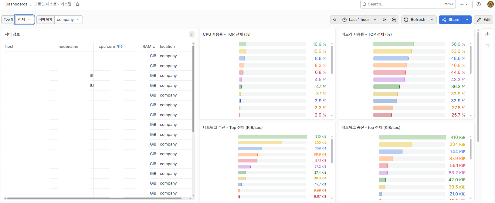
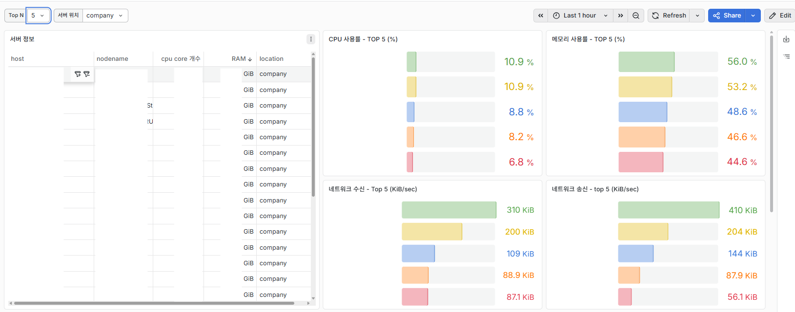
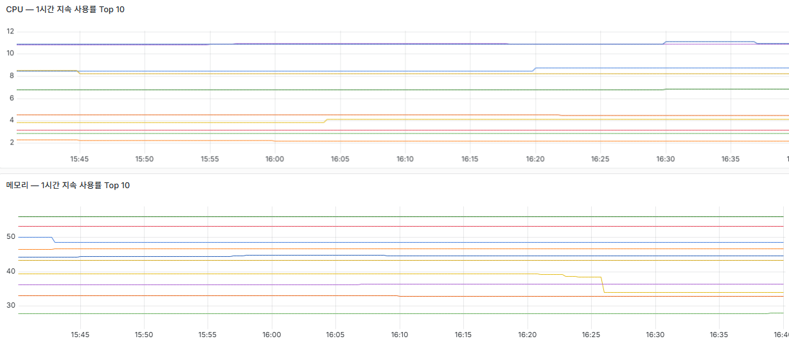
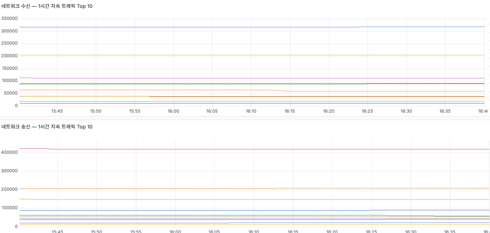

# Ansible

# 활용 계기

인턴 기간 동안 사내 서버와 데이터센터 서버들을 통합 모니터링할 수 있는 환경을 구축하는 업무를 맡았다.   
초기에는 각 서버에 직접 접속해 node_exporter를 설치하고 설정을 맞추는 방식으로 진행해야 했다.  

하지만 약 50개가 넘는 서버에서 이 작업을 진행해야 했기 때문에 반복성이 너무 강하다고 생각했다.    
또한 history 관리 및 작업 로그 등을 남기기가 불편하였다.  
**DevOps 엔지니어를 목표로 인턴**을 시작한 만큼, 단순 반복 작업을 그대로 수행하기보다 자동화할 수 있는 방법을 고민했다.  

또한 **인턴 기간이 끝난 뒤에도 사내에서 실제로 사용할 수 있는 결과물**을 남기고 싶었다.  
그래서 여러 서버에 비슷한 설치,설정 작업을 일관되게 적용할 수 있는 IaC 자동화 툴을 찾아보게 되었다.  

CNCF 검색, ChatGPT 검색 등 여러가지를 알아보면서 RedHat이 개발한 오픈소스 IT 자동화 도구인 Ansible을 이용해보게 되었다.  

---
# 작업내용

`추가 작업`으로 표시한 항목은 기존 요청 범위를 넘어, 모니터링 환경을 더 개선해보고자 직접 구현한 뒤 사수분께 공유드린 내용입니다.  
`추가 공부`으로 표시한 항목은 회사랑 관련 없이, 제가 편할려고 만든 작업 내용입니다.

- [Node Exporter 설치](#Node-Exporter-설치)
- [모든 서버 사양 조사 (`추가 작업`)](#모든-서버-사양-조사)
- [Database로 우회하여 GPU 및 프로세스 상태 변화 수집 (`추가 작업`)](#Database로-우회하여-GPU-및-프로세스-상태-변화-수집)
- [Docker 설치 (`추가 공부`)](#Docker-설치)  
- [Kubernetes 설치 (`추가 공부`)](#Kubernetes-설치)  

## Node Exporter 설치

### Node Exporter란?

Node Exporter는 Prometheus 생태계의 공식 익스포터로, Linux/Unix 서버의 **하드웨어 및 OS 수준 메트릭**을 수집해 Prometheus가 스크랩할 수 있는 형태로 노출한다.

주요 수집 항목은 다음과 같다.

| 항목 | 설명 |
|---|---|
| CPU | 코어별 사용률, idle/iowait/user/system 시간 |
| Memory | 총 메모리, 사용 중, 캐시, 버퍼, 스왑 등 |
| Network | 인터페이스별 송수신 바이트, 패킷, 에러 |

기본 포트는 `9100`이지만, 이 프로젝트에서는 여러 서버에서 포트를 통일하기 위해 사용하지 않는 포트 중 하나인 **`30910`**으로 변경해 운영했다.

---

### 설계 방식

#### 전체 흐름

```
Ansible 제어 노드 (로컬)
    │
    ├─ 1. GitHub에서 node_exporter 바이너리 다운로드 (로컬 /tmp에 캐싱)
    │
    └─ 2. 각 대상 서버로 업로드 → 압축 해제 → 바이너리 배치
               │
               ├─ 3. 전용 시스템 유저(node_exporter) 생성
               ├─ 4. systemd 서비스 등록 및 활성화
               ├─ 5. 방화벽(firewalld / ufw) 중지
               └─ 6. /tmp 임시 파일 정리
```

#### 주요 설계 포인트

**1. 바이너리 로컬 캐싱 (`delegate_to: localhost`)**

50개 이상의 서버에 동일 파일을 배포할 때, 서버마다 GitHub에서 직접 다운로드하면 네트워크 부하가 심하고 속도도 느리다.
아카이브가 로컬 `/tmp`에 없을 때만 한 번 다운로드하고, 이후 서버들에는 `copy` 모듈로 업로드하는 방식을 사용했다.

```yaml
- name: Check node_exporter archive exists
  stat:
    path: "/tmp/node_exporter-{{ node_exporter_version }}.linux-{{ arch }}.tar.gz"
  register: node_exporter_archive
  delegate_to: localhost

- name: Download node_exporter
  get_url:
    url: "https://github.com/prometheus/node_exporter/releases/download/..."
    dest: "/tmp/node_exporter-{{ node_exporter_version }}.linux-{{ arch }}.tar.gz"
  when: not node_exporter_archive.stat.exists
  delegate_to: localhost
```

**2. amd64 / arm64 자동 감지**

사내에 x86 서버와 ARM 서버가 혼재해 있어, `ansible_architecture` 팩트를 활용해 아키텍처를 자동으로 판별했다.

```yaml
- name: Check architecture
  set_fact:
    arch: "{{ 'arm64' if ansible_architecture == 'aarch64' else 'amd64' }}"
```

**3. 전용 시스템 유저 + systemd 보안 강화**

node_exporter 프로세스가 불필요한 권한을 갖지 않도록 로그인 불가 시스템 유저를 생성하고, systemd 유닛에 보안 옵션을 적용했다.

```ini
NoNewPrivileges=true
ProtectHome=true
ProtectSystem=strict
ProtectKernelTunables=true
PrivateTmp=true
PrivateDevices=true
RestrictSUIDSGID=true
```

**4. OS 계열별 방화벽 처리**

Rocky Linux / RHEL 계열은 `firewalld`와 SELinux를, Ubuntu / Debian 계열은 `ufw`를 중지하도록 분기했다.

```yaml
- name: Stop firewalld (Rocky/RHEL 계열만)
  systemd:
    name: firewalld
    state: stopped
  when: ansible_os_family == "RedHat"

- name: Stop ufw (Ubuntu/Debian 계열만)
  systemd:
    name: ufw
    state: stopped
  when: ansible_os_family == "Debian"
```

**5. 불필요한 마운트 포인트 제외**

`/proc`, `/sys`, Docker/컨테이너 관련 overlay 파일시스템 등은 메트릭 노이즈가 심하기 때문에 수집 대상에서 제외했다.

---

### 롤 구조

```
roles/node_exporter/
├── defaults/
│   └── main.yml          # 버전, 포트, 유저명 기본값
├── handlers/
│   └── main.yml          # systemd 재시작 핸들러
├── tasks/
│   └── main.yml          # 설치 태스크 전체
└── templates/
    └── node-exporter.service.j2   # systemd 유닛 템플릿
```

변수는 `defaults/main.yml`에서 관리하므로, 포트나 버전 변경 시 해당 파일만 수정하면 된다.

```yaml
node_exporter_version: "1.8.2"
node_exporter_port: 30910
node_exporter_user: node_exporter
```

---

### 실행 방법

```bash
ansible-playbook -i inventory/hosts.yml install-node-exporter-playbook.yml
```

---

### Grafana 대시보드 결과









---
# 트러블 슈팅


---
# 추가 작업 진행해볼 것
