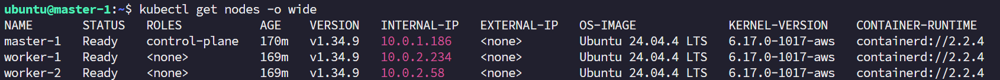
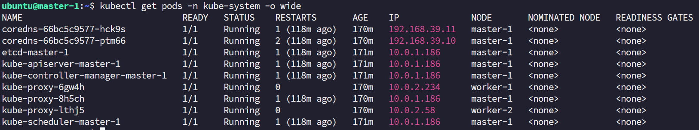
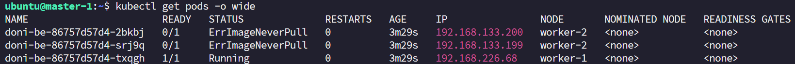
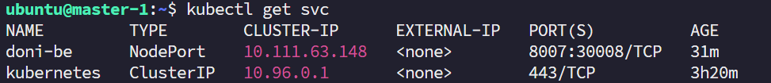

# HA Kubernetes Cluster 구축 (v2)

[← README로 돌아가기](README.md)

Ansible + Terraform으로 kubeadm 기반 Kubernetes 클러스터를 자동 구축·운영하는 작업이다.

> **왜 v2인가**
> Terraform으로 AWS 인스턴스를 생성하고, 그 인스턴스 위에 Ansible을 적용하는 구조다.
> 따라서 Terraform이 v3로 업그레이드되면 인프라 구성이 바뀌며 Ansible 쪽 코드도 조금씩 달라질 수 있다.
> 지금 구성을 **아카이빙**해 두는 의미로 `v2`로 표기한다. (v3 예정 작업은 각 트러블슈팅 끝에 메모해 둔다.)

---

# 목차

- [개요](#개요)
- [실행 방법](#실행-방법)
- [검증 결과](#검증-결과)
- [트러블 슈팅](#트러블-슈팅)
  - [1. Worker Node ↔ Control Plane SG Inbound](#1-worker-node--control-plane-sg-inbound)
  - [2. 대용량 파일 전송 중 Control Plane OOM](#2-대용량-파일-전송-중-control-plane-oom)
- [Harness Engineering](#harness-engineering)

---

# 개요

- **프로비저닝** — Terraform으로 VM 생성, `generate-cluster-hosts.sh`가 terraform output을 읽어 인벤토리를 생성한다.
- **K8s** — kubeadm 기반, K8s 1.24 이상 (`k8s_version` 변수로 선택)
- **CRI** — containerd / CRI-O / Docker(cri-dockerd) 중 선택 (`cri_type`)
- **CNI** — Calico / Flannel / Cilium 중 선택 (`cni_type`)
- **구성** — 단일 Control Plane(단순), 또는 Control Plane 3대 이상 홀수인 **HA 구성**
  (HA일 때만 HAProxy + Keepalived VIP가 붙는다)
- **폐쇄망 Worker** — 인터넷 아웃바운드가 차단된 Worker는 Control Plane에서 `.deb`·이미지를 받아 **오프라인 설치**한다 (`install_kubernetes_offline_worker: true`)

구성 항목은 `inventory/group_vars/all.yml`에 `install_kubernetes_*` 변수로 저장된다.

---

# 실행 방법

```bash
# 1. 인벤토리 생성 (terraform output 기반, 매번 재생성 권장)
./inventory/generate-cluster-hosts.sh

# 2. 연결 확인
ansible all -i inventory/ha-cluster-ssm.yml -m ping

# 3. 클러스터 구축
ansible-playbook -i inventory/ha-cluster-ssm.yml install-kubernetes-playbook.yml
```

---

# 검증 결과

## 노드 구성



`kubectl get nodes -o wide` 결과. 의도한 대로 **containerd**·**Ubuntu** 버전이 맞고, **Control Plane은 public subnet(`10.0.1.0/24`)**, **Worker는 private subnet(`10.0.2.0/24`)**에 위치하며, Kubernetes 버전은 **`1.34.9`**로 구성된 것을 확인할 수 있다.

## 시스템 Pod



`kube-proxy`는 3개 노드 모두에, `kube-scheduler`·`controller-manager`·`kube-apiserver`·`etcd`는 Control Plane에만 떠 있다.

> 이들 컴포넌트와 `kube-proxy`는 **hostNetwork**라 노드 IP(`10.0.x`)로 보인다. 반면 `coredns`는 일반 Pod라 **Calico Pod 네트워크 CIDR(기본 `192.168.0.0/16`)**에서 IP를 받기 때문에 `192.168.x`로 표시된다 — 정상이다.

## 폐쇄망 입증



BMT용으로 직접 만든 이미지(`*.tar.gz`)를 **worker-1에만** `scp`로 전달해 푼 뒤, Control Plane에서 YAML로 Deployment(replica 3)와 Service를 올렸다.  
그 결과 이미지가 있는 **worker-1의 Pod만 `Running`**, 이미지가 없는 **worker-2의 Pod는 `ImagePullError`**가 떴다. Worker가 인터넷 없이 **로컬에 적재된 이미지에만 의존하는 폐쇄망임을 입증**한 셈이다.

## Service



`kubectl get svc` 결과.

---

# 트러블 슈팅

## 1. Worker Node ↔ Control Plane SG Inbound

클러스터를 구성하는 중 노드 간 통신이 자꾸 타임아웃 났다.  
원인을 따라가 보니, **Control Plane의 Security Group Inbound에 Worker Node에서 오는 트래픽을 열어두지 않아서** 통신이 되지 않은 것이었다. (kubelet ↔ apiserver, etcd, CNI 등 양방향 통신이 필요한데 한쪽이 막혀 있었다.)

쿠버네티스가 노드 간 어떤 포트를 쓰는지는 공식 문서에 정리돼 있다.

- [Ports and Protocols — Kubernetes 공식 문서](https://kubernetes.io/docs/reference/networking/ports-and-protocols/)

처음에는 이 문서를 보고 필요한 포트만 정확히 열려고 했다.  
그런데 **CRI를 설정할 때 추가로 열어야 할 포트가 너무 많아**(런타임·CNI마다 상이) 일일이 맞추기 어려웠다.  
그래서 우선 **Worker Node에서 오는 트래픽(SG 소스 = Worker SG)은 모든 포트를 허용**하도록 열어 통신을 살려두었다.

> **v3 예정** — CNI를 **Calico로 고정**한 뒤, Calico가 실제로 쓰는 포트만 정확히 골라 SG Inbound를 최소 권한으로 좁힐 계획이다.

## 2. 대용량 파일 전송 중 Control Plane OOM

폐쇄망 Worker용으로 Control Plane(CP)에 캐시된 컨테이너 이미지 tar(약 344MB)를 제어 노드로 가져오려고 Ansible `fetch` 모듈을 썼다.  
그런데 CP의 SSH가 통째로 먹통이 됐다. 콘솔 로그를 보니 OOM killer가 `apiserver`, `calico-typha`, `coredns` 등을 차례로 죽이고 있었다.

```
Out of memory: Killed process (apiserver)
Out of memory: Killed process (calico-typha)
```

`fetch` 모듈은 원격 파일을 **base64로 인코딩해 메모리에 통째로 올린 뒤** 가져온다. 344MB가 460MB+로 부풀면서, 메모리가 4GiB뿐인 CP가 스왑 thrashing에 빠졌고 sshd까지 응답하지 못한 것이다.  
AWS 상태 검사는 정상(`ok`)이었지만 OS userspace가 멈춰 있어, 결국 인스턴스를 재부팅(`aws ec2 reboot-instances`)해 복구했다. kubeadm 클러스터는 재부팅에 강해서 static pod(etcd / apiserver 등)가 자동으로 다시 떠 클러스터 상태 자체는 보존됐다.

복구 후에는 `fetch` 대신 **`scp`**로 전송했다. scp는 인코딩 없이 바이너리를 스트리밍하므로 메모리를 거의 쓰지 않는다.  
이 일로 **노드 간 대용량 파일 전송은 `fetch` / `copy` 모듈 대신 `scp`로 통일**한다는 규칙을 컨벤션에 못 박았다.

> **v3 예정** — 이미지·패키지를 노드 사이로 직접 옮기는 대신 **S3를 저장소로 두고, 각 노드가 S3에서 직접 받도록** 바꿀 계획이다. 제어 노드 / CP 메모리를 거치지 않으므로 이 OOM을 원천 차단할 수 있다.

---

# Harness Engineering

이 저장소는 [Claude Code](https://docs.anthropic.com/en/docs/claude-code) 기반으로 K8s 운영 작업을 자동화·표준화하기 위해 **Skills · Hooks · Rules** 세 계층으로 harness를 설계했다.

## Skills — 대화형 워크플로우

반복되는 작업을 "버전·CRI·CNI 선택 → Terraform → 인벤토리 → Ansible"처럼 단계별 절차로 캡슐화한 슬래시 커맨드다.

| 스킬 | 역할 |
|---|---|
| `/k8s-setup` | 신규 클러스터 구축 (구성 대화형 선택 후 전 파이프라인 안내) |
| `/k8s-node-add` | 노드 추가 (Terraform VM → 인벤토리 갱신 → Ansible join) |
| `/k8s-node-remove` | 노드 제거 (drain → delete → Ansible 정리 → Terraform 삭제) |
| `/k8s-verify` | 클러스터 상태 점검 (노드 / 시스템 Pod / etcd / CNI) — 읽기 전용 |
| `/new-role` | 프로젝트 컨벤션에 맞는 Ansible role 골격 생성 |
| `/git-commit` | AngularJS 컨벤션으로 커밋·푸시 |
| `/update-readme` | 실제 코드 기준으로 README 동기화 |

## Hooks — 자동 개입

| 훅 | 이벤트 | 동작 |
|---|---|---|
| `keyword-detector.sh` | UserPromptSubmit | 프롬프트에서 K8s 키워드(구축 / 노드 추가·제거 / 상태 확인 / role 생성)를 감지해, 알맞은 스킬을 안내하는 컨텍스트를 주입한다. |
| `k8s-safety.sh` | PreToolUse (Bash) | 파괴적 명령(`kubeadm reset`, `terraform destroy`, `kubectl drain`, `kubectl delete node`, `etcdctl member remove` / `del`)을 **차단**하고, 터미널에서 직접 실행하도록 유도한다. |

## Rules — 안전 규칙

`CLAUDE.md`에 **"승인 필수" 작업**(terraform apply, kubectl drain/delete, kubeadm reset, etcdctl 직접 조작, 인증서 갱신, 버전 업그레이드)을 표로 명문화했다.  
그리고 이 중 파괴적인 명령들은 위 `k8s-safety.sh` 훅이 기계적으로 차단한다.  
즉 **rule은 문서(CLAUDE.md)로 선언하고, hook으로 강제 집행**하는 이중 구조다. 사람이 규칙을 잊더라도 훅이 마지막 방어선이 된다.

## Docs — 컨텍스트 분할

Claude Code는 세션을 시작할 때 `CLAUDE.md`를 **항상 로드**한다. 모든 상세 내용을 여기에 담으면 매 세션 컨텍스트(토큰)를 그만큼 소비한다.  
그래서 상세 문서를 `.claude/docs/`로 **분할**해 두고(아키텍처·컨벤션·S3 계획 등), `CLAUDE.md`에는 요약과 포인터만 남겼다. 각 문서는 **필요한 스킬이 실행될 때만 읽어 들인다.**

- `/k8s-setup` → 시작 시 `.claude/docs/architecture.md`를 로드
- `/new-role` → `.claude/docs/conventions.md`를 참조

→ 평상시 컨텍스트는 가볍게 유지하면서, 작업할 때만 관련 문서를 끌어오는 구조다. 토큰 소비를 줄이는 동시에 문서·코드·스킬이 한 곳을 바라보게 해 일관성도 확보한다.
